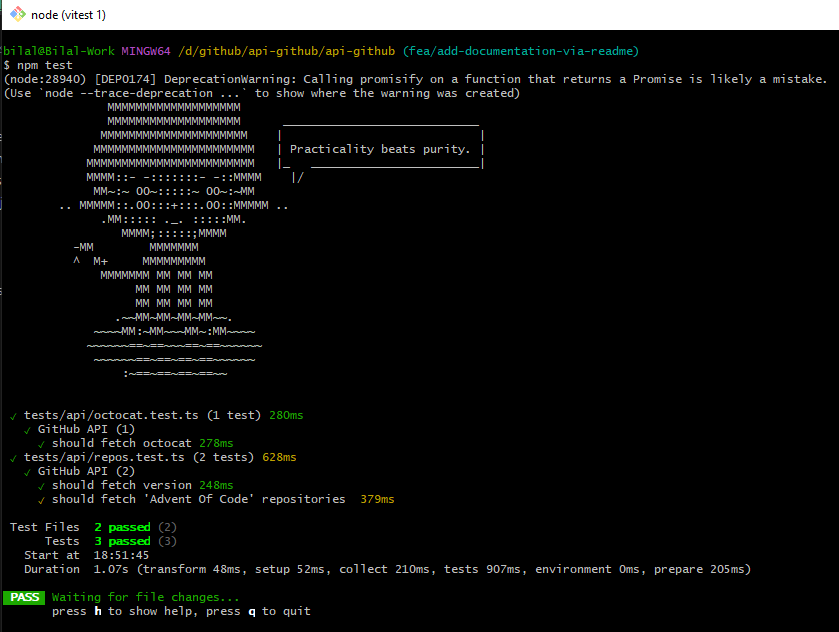
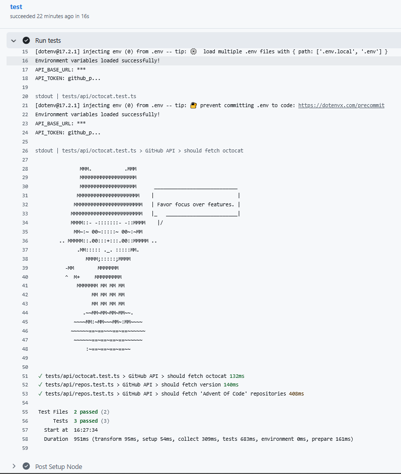

# 🧪 A Professional Starting Point for GitHub API Test Suite

A robust TypeScript-based test suite for GitHub API endpoints using Vitest and Axios. Features secure environment management and CI/CD integration.

## ✨ Features

- **✅ API Testing**: Comprehensive tests for GitHub REST API endpoints
- **🔒 Security**: Secure token management using environment variables and GitHub Secrets
- **🚀 CI/CD Ready**: GitHub Actions workflow for automated testing
- **📝 TypeSafe**: Full TypeScript support with strict linting
- **⚡ Fast**: Vitest-based testing with instant feedback

## 🛠️ Tech Stack

- **Testing Framework**: [Vitest](https://vitest.dev/)
- **HTTP Client**: [Axios](https://axios-http.com/)
- **Language**: [TypeScript](https://www.typescriptlang.org/)
- **CI/CD**: [GitHub Actions](https://github.com/features/actions)
- **Linting**: [ESLint](https://eslint.org/) + [Prettier](https://prettier.io/)

## 📦 Installation

```bash
# Clone the repository
git clone https://github.com/your-username/api-github.git
cd api-github

# Install dependencies
npm install
```

## ⚙️ Configuration

### Environment Variables

Create a `.env` file in the root directory:

```env
API_TOKEN=your_github_personal_access_token_here
API_BASE_URL=https://api.github.com
```

### GitHub Personal Access Token

1. Go to **GitHub Settings** → **Developer settings** → **Personal access tokens**
2. Generate a new fine grained personal access token
3. Add the token to your `.env` file and GitHub Secrets

## 🧪 Running Tests

```bash
# Run tests once
npm test

# Run tests in watch mode
npm run test:watch

# Run linting
npm run lint

# Fix linting issues
npm run lint:fix
```

## 🔒 Security Setup

### GitHub Secrets Configuration

Add these secrets to your repository settings:

1. Go to **Repository Settings** → **Secrets and variables** → **Actions**
2. Add these secrets:
   - `API_TOKEN`: Your GitHub Personal Access Token
   - `API_BASE_URL`: `https://api.github.com`

## 📁 Project Structure

```
api-github/
├── tests/
│   ├── api/                 # API test suites
│   ├── utils/               # Test utilities
│   └── setup.ts             # Test environment setup
├── .github/
│   └── workflows/
│       └── test.yml         # CI/CD workflow
├── .env.example             # Environment template
├── vitest.config.ts         # Vitest configuration
├── eslint.config.js         # ESLint configuration
└── tsconfig.json           # TypeScript configuration
```

## 🚀 CI/CD Pipeline

The GitHub Actions workflow automatically:

1. ✅ Runs on every push and pull request
2. ✅ Executes linting checks first (fails fast on errors)
3. ✅ Runs all API tests against GitHub API
4. ✅ Uses secure token management via GitHub Secrets
5. ✅ Provides detailed test reports

## 🎯 Example Test

```typescript
import { describe, it, expect } from 'vitest';
import { createHttpClient } from '../utils/httpClient';

describe('GitHub Users API', () => {
  const client = createHttpClient();

  it('should fetch user repositories', async () => {
    const response = await client.get('/user/repos', {
      params: { visibility: 'public' }
    });

    expect(response.status).toBe(200);
    expect(response.headers['content-type']).toMatch(/json/);
    expect(Array.isArray(response.data)).toBe(true);
  });
});
```

## 📊 Code Quality

- **ESLint**: Strict TypeScript linting rules
- **Prettier**: Consistent code formatting
- **Pre-commit hooks**: Quality checks before committing
- **CI enforcement**: No merging without passing checks

## 🤝 Contributing

1. Fork the repository
2. Create a feature branch: `git checkout -b feature/new-tests`
3. Add tests and ensure they pass: `npm test`
4. Commit changes: `git commit -am 'Add new API tests'`
5. Push to branch: `git push origin feature/new-tests`
6. Submit a pull request

## 📄 License

This project is licensed under the MIT License - see the [LICENSE](LICENSE) file for details.

## 🙏 Acknowledgments

- [GitHub REST API](https://docs.github.com/en/rest)
- [Vitest](https://vitest.dev/) for excellent testing experience
- [Axios](https://axios-http.com/) for reliable HTTP requests

---

## 🚦 Status

[](https://github.com/taherkheli/api-github/actions/workflows/test.yml)


---

## Screenshots

### Local Test Run (Successful)



### CI/CD Test Run (Successful)


